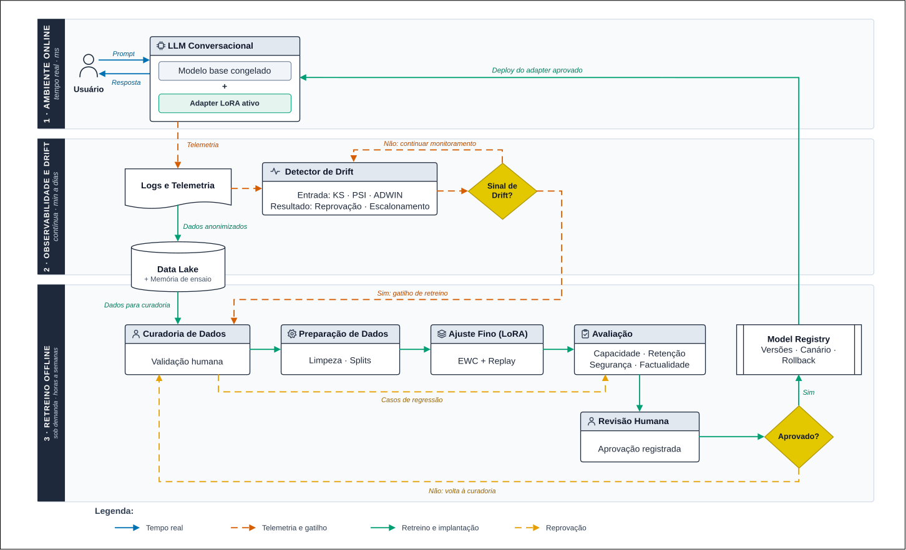
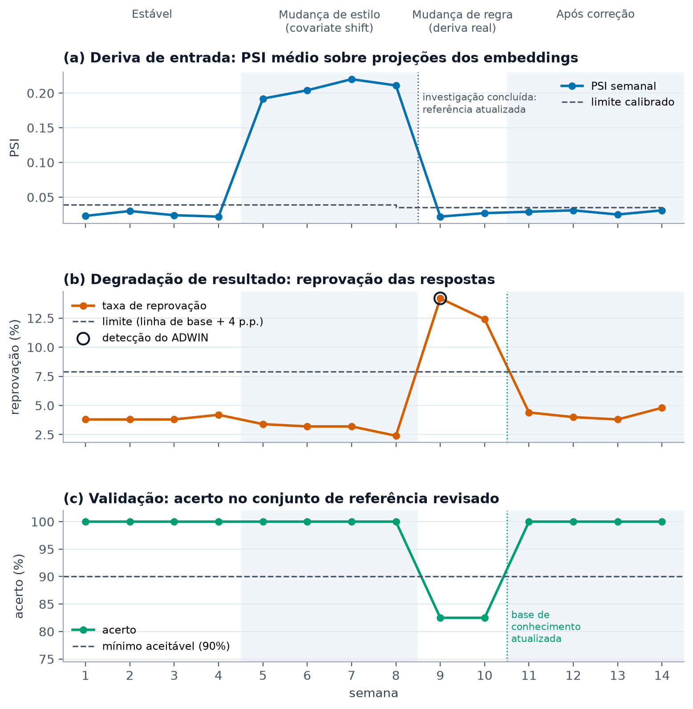

# Proposta de Aprendizado Contínuo para Sistemas Conversacionais: como lidar com o Concept Drift

> **Área:** Machine Learning Operations (MLOps), Sistemas Conversacionais e Aprendizado Contínuo
> **Tipo de documento:** proposta de arquitetura
> **Palavras-chave:** concept drift, aprendizado contínuo, esquecimento catastrófico, LoRA, monitoramento, MLOps

## Sumário

- [1. Introdução](#1-introdução)
  - [1.1 O problema: modelos que param no tempo](#11-o-problema-modelos-que-param-no-tempo)
  - [1.2 O que é concept drift](#12-o-que-é-concept-drift)
  - [1.3 Por que não basta retreinar o modelo](#13-por-que-não-basta-retreinar-o-modelo)
  - [1.4 Justificativa da proposta](#14-justificativa-da-proposta)
- [2. Solução Proposta](#2-solução-proposta)
  - [2.1 Visão geral e princípios](#21-visão-geral-e-princípios)
  - [2.2 Diagrama de arquitetura](#22-diagrama-de-arquitetura)
  - [2.3 Responsabilidades de cada módulo](#23-responsabilidades-de-cada-módulo)
  - [2.4 Como o ciclo funciona na prática](#24-como-o-ciclo-funciona-na-prática)
  - [2.5 Prova de conceito: o Detector de Drift em funcionamento](#25-prova-de-conceito-o-detector-de-drift-em-funcionamento)
- [3. Conclusão](#3-conclusão)
  - [3.1 Considerações pessoais sobre a proposta](#31-considerações-pessoais-sobre-a-proposta)
  - [3.2 Esforço necessário para a implementação](#32-esforço-necessário-para-a-implementação)
  - [3.3 Considerações finais](#33-considerações-finais)
- [4. Referências Bibliográficas](#4-referências-bibliográficas)

## 1. Introdução

### 1.1 O problema: modelos que param no tempo

A maneira mais comum de construir um sistema conversacional com aprendizado de máquina segue sempre o mesmo roteiro. Reúne-se um conjunto de dados, treina-se o modelo, mede-se o desempenho em um conjunto de teste e, se o resultado for bom, o modelo é colocado em produção. A partir daí, seus parâmetros ficam congelados por meses ou até anos. Isso vale tanto para os classificadores de intenção dos chatbots tradicionais quanto para os *Large Language Models* (LLMs) que passam por ajuste fino.

Esse roteiro depende de uma suposição que raramente se confirma: a de que os dados vistos em produção continuarão parecidos com os dados usados no treinamento. Na prática, o mundo muda. Surgem produtos novos, regras são revistas, o vocabulário dos usuários evolui e os assuntos mais procurados variam ao longo do ano. O modelo, por outro lado, continua refletindo o momento em que foi treinado. Ele funciona como uma fotografia: mostra com fidelidade um instante que já passou.

O aspecto mais perigoso desse problema é que **a perda de qualidade acontece em silêncio**. Um chatbot desatualizado não trava, não exibe mensagem de erro e não dispara nenhum alarme de infraestrutura. Ele continua respondendo com fluência e confiança, só que cada vez mais errado. Em modelos generativos, isso aparece como respostas inventadas, informações sobre políticas que já foram revogadas ou dificuldade para entender termos que se tornaram comuns. Como não existe um sinal explícito de falha, é preciso criar um mecanismo dedicado de monitoramento, e esse mecanismo é o ponto central desta proposta.

Sculley *et al.* (2015) já apontavam as "mudanças no mundo externo" como uma das fontes de dívida técnica mais difíceis de controlar em sistemas de aprendizado de máquina. No caso dos sistemas conversacionais, três características tornam o problema ainda mais sério:

* **A entrada é aberta.** Diferente de um formulário com campos fixos, o usuário pode escrever qualquer coisa, de qualquer jeito. Não há uma forma simples de saber se uma pergunta está "dentro" do que o modelo conhece.
* **O sistema influencia o próprio usuário.** As pessoas aprendem quais formas de perguntar funcionam melhor e passam a escrever de outro jeito. Com isso, os dados que o sistema recebe mudam por causa do próprio sistema, um efeito que Sculley *et al.* (2015) chamam de laço de realimentação oculto.
* **Boa parte do valor depende de informações que mudam rápido.** Preços, prazos, procedimentos e normas costumam ser exatamente o que os usuários mais perguntam, e são também os primeiros dados a ficar desatualizados.

### 1.2 O que é concept drift

**Concept drift**, ou deriva de conceito, é o nome dado à mudança, ao longo do tempo, na relação estatística entre as entradas de um modelo e as saídas corretas. O tema é tratado de forma ampla nas revisões de Gama *et al.* (2014) e Lu *et al.* (2019).

Considere as entradas $X$ (por exemplo, a pergunta do usuário) e as saídas $Y$. Na literatura, o termo concept drift é usado com frequência em **sentido amplo**, para qualquer mudança na distribuição conjunta dos dados entre um instante $t$ e um instante posterior $t + \Delta$ (GAMA *et al.*, 2014; LU *et al.*, 2019):

$$P_t(X, Y) \neq P_{t+\Delta}(X, Y)$$

Essa condição, porém, também é satisfeita quando muda apenas o jeito de perguntar, sem que a resposta correta mude. Por isso, as mesmas revisões separam esse caso de outro, chamado de **deriva real** (*real concept drift*), em que muda a própria relação entre a entrada e a saída correta:

$$P_t(Y \mid X) \neq P_{t+\Delta}(Y \mid X)$$

Este trabalho mantém essa diferença ao longo do texto. Uma coisa é a **mudança na distribuição dos dados**, que pode acontecer sem prejudicar as respostas. Outra é a **mudança na relação entre entrada e saída**, que torna respostas antes corretas em respostas erradas. A segunda é o foco principal da adaptação proposta, porque é a que exige que o sistema aprenda algo novo.

Como a distribuição conjunta pode ser decomposta em $P(X, Y) = P(Y \mid X) \cdot P(X)$, é possível separar as mudanças nos dados em tipos diferentes, e cada um pede uma reação diferente (GAMA *et al.*, 2014; LU *et al.*, 2019).

| Tipo | O que muda | Exemplo em um chatbot | Consequência |
|---|---|---|---|
| **Covariate shift** (deriva virtual) | Muda o *jeito* de perguntar, $P(X)$, mas a resposta certa continua a mesma | Usuários passam a usar gírias, abreviações ou mensagens de voz transcritas | O modelo passa a receber entradas diferentes das que viu no treino e erra mais |
| **Concept drift real** | Muda *qual é a resposta certa*, $P(Y \mid X)$ | O prazo de reembolso muda de 7 para 30 dias, mas a pergunta continua idêntica | O modelo responde errado com total confiança |
| **Deriva de prior** | Muda a *frequência* das classes previstas, $P(Y)$, quando $Y$ é a intenção do usuário | Em época de matrícula, a intenção "dúvida sobre matrícula" passa a dominar as conversas | Limiares de confiança e roteamento deixam de estar calibrados |

Na tabela, o significado de $Y$ depende da tarefa. Nas duas primeiras linhas, $Y$ é a resposta correta. Na deriva de prior, o exemplo considera a etapa de classificação de intenção, comum em chatbots, em que $Y$ é a intenção do usuário. Em uma tarefa puramente generativa, a distribuição das respostas não corresponde necessariamente à frequência dos temas, então essa análise se aplica às intenções ou categorias que o sistema identifica.

O tipo mais grave é o **concept drift real**. Nele, a pergunta que chega ao sistema é exatamente igual à de antes, então nenhum monitoramento que olhe apenas para a entrada consegue perceber a mudança. Por isso, a arquitetura proposta mais adiante monitora não só o que os usuários perguntam, mas também indícios de que as respostas estão piorando, como reclamações, reformulações e pedidos de atendimento humano. Esses indícios são indiretos e precisam ser confirmados antes de qualquer ação, como explicado na Seção 2.3.

A deriva também varia na forma como acontece ao longo do tempo. Gama *et al.* (2014) a classificam como **abrupta** (uma mudança de regra que vale a partir de um dia específico), **gradual** (um termo novo que vai sendo adotado aos poucos), **incremental** (o vocabulário que se desloca lentamente) ou **recorrente** (picos sazonais, como fim de semestre ou fechamento fiscal). Essa distinção importa porque cada técnica de detecção funciona melhor para um tipo. Janelas adaptativas como o ADWIN, por exemplo, reagem bem a mudanças abruptas (BIFET; GAVALDÀ, 2007), enquanto derivas lentas exigem comparações em períodos mais longos.

### 1.3 Por que não basta retreinar o modelo

Diante da deriva, a reação mais intuitiva é retreinar o modelo com dados novos. O problema é que essa solução cria um segundo problema, tão sério quanto o primeiro: o **esquecimento catastrófico**.

Descrito originalmente por McCloskey e Cohen (1989), o esquecimento catastrófico acontece quando uma rede neural aprende algo novo e, nesse processo, apaga o que sabia antes. Isso ocorre porque o treinamento ajusta os pesos apenas para acertar os exemplos novos, sem nenhuma informação sobre o que era importante para os exemplos antigos. O resultado é um modelo que melhora no assunto recente e piora em todo o resto. Esse conflito entre aprender o novo e preservar o antigo é conhecido como **dilema entre estabilidade e plasticidade** (PARISI *et al.*, 2019).

Em LLMs, o problema vai além da perda de conhecimento. Qi *et al.* (2024) mostraram algo especialmente preocupante: o ajuste fino pode enfraquecer as proteções de segurança de um modelo alinhado, inclusive quando os dados usados no treino são inofensivos. Ou seja, um retreino feito sem cuidado pode deixar o chatbot menos seguro sem que ninguém perceba.

Isso deixa duas opções ingênuas, ambas ruins. Retreinar tudo do zero com frequência preserva o conhecimento, mas é muito caro e lento. Fazer ajuste fino apenas com os dados novos é rápido e barato, mas leva diretamente ao esquecimento catastrófico.

A saída está no campo do **aprendizado contínuo**, que estuda como um modelo pode aprender coisas novas sem esquecer as antigas. Parisi *et al.* (2019) organizam as técnicas dessa área em três grandes famílias, e esta proposta usa as três de forma combinada:

1. **Regularização.** Penaliza mudanças nos pesos que eram importantes para tarefas anteriores. O exemplo clássico é o *Elastic Weight Consolidation* (EWC), proposto por Kirkpatrick *et al.* (2017), que estima a importância de cada peso e dificulta que os mais importantes sejam alterados.
2. **Ensaio (replay).** Mantém uma memória com exemplos representativos do passado e mistura esses exemplos aos dados novos durante o treino. Parisi *et al.* (2019) apontam o replay como uma das estratégias mais diretas contra o esquecimento, inspirada na forma como o cérebro reativa memórias antigas enquanto aprende algo novo. Seu custo principal é manter e selecionar bem essa memória.
3. **Isolamento de parâmetros.** Congela o modelo original e adiciona uma pequena estrutura nova e treinável para cada atualização. Uma das técnicas mais usadas hoje é a LoRA (*Low-Rank Adaptation*), de Hu *et al.* (2022), que mantém os pesos originais intactos e treina apenas pequenas matrizes adicionais, reduzindo em até 10.000 vezes o número de parâmetros treináveis. Como o modelo base nunca é alterado, um adapter com problema pode ser descartado e os parâmetros da versão anterior restaurados. Isso protege o modelo, mas não resolve outros riscos, como dados inadequados já armazenados ou falhas operacionais, discutidos na Conclusão.

Cada família foi estudada principalmente de forma isolada e em cenários específicos. A combinação das três que esta proposta adota é uma escolha de projeto, e sua eficácia precisa ser validada experimentalmente para o modelo e a tarefa escolhidos.

### 1.4 Justificativa da proposta

Juntando os pontos acima, chega-se a um sistema que piora sozinho, sem avisar, e cuja correção mais óbvia gera um novo problema. Por isso, a atualização do modelo não deve ser tratada como uma tarefa manual feita de vez em quando, e sim como uma capacidade permanente da arquitetura.

A literatura de engenharia reforça essa visão. Sculley *et al.* (2015) mostraram que o código do modelo em si é uma parte pequena de um sistema de aprendizado de máquina em produção, e que a maior parte do esforço está na infraestrutura ao redor: coleta de dados, monitoramento, configuração e implantação.

Uma proposta que se limitasse a escolher uma técnica de aprendizado contínuo estaria resolvendo a menor parte do problema. Por isso, a solução apresentada a seguir organiza todas as etapas (coleta, detecção, curadoria, treino, avaliação e implantação) em um ciclo fechado e controlado.

## 2. Solução Proposta

### 2.1 Visão geral e princípios

A proposta é uma arquitetura de **aprendizado contínuo em ciclo fechado**. O sistema observa o próprio comportamento em produção, detecta quando está ficando desatualizado e, quando há evidência suficiente, produz uma nova versão do modelo, avalia essa versão com rigor e só então a coloca em uso. O objetivo não é eliminar a deriva, o que seria impossível porque ela vem de mudanças no mundo real. O objetivo é **reduzir o tempo entre o surgimento da deriva e a correção do modelo**, mantendo cada atualização segura, rastreável e reversível.

A arquitetura segue seis princípios:

1. **Detectar antes de agir.** O retreino não acontece por calendário, e sim quando existe evidência de que o modelo piorou. Retreinar sem necessidade gasta recursos e cria risco de regressão sem nenhum benefício.
2. **Isolar parâmetros por padrão.** O modelo base fica congelado e toda adaptação acontece em adapters LoRA. Assim, o modelo base fica protegido do esquecimento e reverter os parâmetros de uma atualização se resume a trocar o adapter.
3. **Manter uma memória explícita.** Um conjunto versionado de exemplos importantes é misturado a todo novo treino, para que o modelo não esqueça o que já sabia.
4. **Não pular o portão de qualidade.** Nenhuma versão nova chega aos usuários sem passar por testes automáticos e por uma revisão humana registrada.
5. **Implantar aos poucos e com possibilidade de reversão.** Cada versão nova é exposta a uma parcela pequena dos usuários antes de ser liberada para todos, e é revertida automaticamente se métricas definidas previamente ultrapassarem os limites estabelecidos.
6. **Manter pessoas nos pontos críticos.** A curadoria de dados sensíveis e a aprovação final de uma nova versão continuam sendo decisões humanas.

### 2.2 Diagrama de arquitetura



*Figura 1: Arquitetura de aprendizado contínuo proposta. Fonte: elaboração própria.*

> **Arquivos do diagrama:** a fonte editável está em [diagrama-arquitetura.drawio](diagrama-arquitetura.drawio), que pode ser aberta em [app.diagrams.net](https://app.diagrams.net) ou na extensão Draw.io do VS Code. Há também uma versão em imagem em [diagrama-arquitetura.png](diagrama-arquitetura.png).

**Como ler o diagrama.** O sistema está dividido em três faixas horizontais, e cada uma funciona em um ritmo diferente, indicado na lateral esquerda:

* **Camada 1, Ambiente Online** (tempo real, milissegundos): é a única parte que o usuário enxerga.
* **Camada 2, Observabilidade e Drift** (contínua, de minutos a dias): transforma o uso do sistema em evidência sobre a qualidade do modelo.
* **Camada 3, Retreino Offline** (sob demanda, de horas a semanas): é onde o modelo efetivamente muda, e só entra em ação quando é acionada.

O **Data Lake** aparece de propósito na fronteira entre as camadas 2 e 3, porque recebe dados de forma contínua da observabilidade e os entrega ao retreino quando necessário.

As **formas** indicam o tipo de cada elemento. Retângulos com barra de título são módulos que processam algo. O documento com base ondulada representa registros, o cilindro representa um repositório de dados e o retângulo com barras laterais representa um registro de versões. Os losangos são pontos de decisão.

As **cores das setas** indicam o tipo de fluxo:

| Seta | Significado |
|---|---|
| Azul contínua | Fluxo de dados em tempo real entre usuário e modelo |
| Laranja tracejada | Telemetria, monitoramento e gatilho de retreino |
| Verde contínua | Dados, retreino e implantação de novas versões |
| Âmbar tracejada | Reprovação e realimentação de falhas |

### 2.3 Responsabilidades de cada módulo

#### Camada 1: Ambiente Online

**Usuário.** É quem inicia e encerra cada interação, por qualquer canal (web, aplicativo ou voz). Ele envia o *prompt* e recebe a resposta pelas setas azuis. Além de gerar a demanda, o usuário também é a principal fonte de sinais sobre a qualidade do sistema, por meio de avaliações, reformulações e pedidos de atendimento humano.

**LLM Conversacional.** É o módulo que gera as respostas. Ele é formado por duas partes visualmente separadas no diagrama: o **modelo base congelado**, que nunca é alterado, e o **adapter LoRA ativo**, que contém as adaptações mais recentes. Essa separação é a decisão de projeto mais importante da arquitetura. Ela permite mudar o comportamento do sistema trocando apenas o adapter, que é pequeno, em vez de substituir o modelo inteiro. Também permite reverter rapidamente os parâmetros de uma atualização ruim. A cada interação, o módulo envia um registro para a camada de observabilidade (seta "Telemetria").

#### Camada 2: Observabilidade e Drift

**Logs e Telemetria.** É o instrumento de medição de todo o ciclo. Se os registros forem pobres, o sistema vai aprender com ruído. O módulo guarda três tipos de informação:

* **Eventos de cada interação:** identificador da sessão, versão do modelo e do adapter usados, tempo de resposta e data. Isso permite descobrir, meses depois, qual versão causou um problema.
* **Feedback explícito e implícito:** avaliações positivas e negativas, mas também sinais indiretos, como o usuário reformular a pergunta, abandonar a conversa ou pedir para falar com um atendente.
* **Rastros da inferência:** quais documentos foram consultados e quais ferramentas foram usadas para gerar a resposta.

Por lidar com conversas reais, este módulo aplica **anonimização na origem**, antes de qualquer dado ser armazenado, além de política de retenção e trilha de auditoria. Essa medida contribui para a proteção de dados, mas não garante sozinha a conformidade com a Lei Geral de Proteção de Dados (BRASIL, 2018). Pela lei, um dado só deixa de ser pessoal se a anonimização não puder ser revertida com meios técnicos razoáveis, considerando fatores como custo e tempo (BRASIL, 2018, art. 5º e art. 12). Por isso, a adequação à LGPD depende da efetividade real da anonimização, da base legal aplicável ao uso das conversas e das demais medidas de governança descritas no Data Lake. Os registros seguem por dois caminhos: as métricas vão para o Detector de Drift e os dados anonimizados vão para o Data Lake.

**Detector de Drift.** É o módulo que decide se existe evidência suficiente de que o modelo está ficando desatualizado. Ele substitui o "retreinar porque já passou um mês" pelo "retreinar porque os dados mostram que é preciso". Trabalha com dois grupos de sinais complementares:

* **Deriva de entrada:** as perguntas são convertidas em representações numéricas (*embeddings*) e a distribuição das perguntas recentes é comparada com a de um período de referência. Como os *embeddings* são vetores de alta dimensão e o teste de Kolmogorov e Smirnov (KS) compara distribuições de uma única variável, os testes não são aplicados ao vetor inteiro. O KS é aplicado a dimensões selecionadas ou a projeções definidas previamente (por exemplo, os primeiros componentes de uma redução de dimensionalidade), com correção para múltiplas comparações. O *Population Stability Index* (PSI) é calculado sobre essas mesmas projeções ou sobre a proporção de perguntas em cada agrupamento de assuntos. Os limiares de ambos são calibrados com dados históricos. Rabanser, Günnemann e Lipton (2019) mostraram que testes estatísticos simples aplicados a representações de dimensão reduzida, com esse tipo de correção, estão entre as formas mais eficazes de detectar mudanças na distribuição dos dados.
* **Degradação de resultado:** acompanha a taxa de reprovação das respostas, os pedidos de atendimento humano e as reformulações de perguntas. Essas taxas formam séries temporais de indicadores escalares, e é sobre elas que se aplica o ADWIN (BIFET; GAVALDÀ, 2007), que identifica quando a média recente de um indicador se afasta da média anterior. São indicadores indiretos de qualidade e podem revelar indícios de deriva real, que não aparece na entrada.

Um ponto importante: **nenhum desses sinais, isoladamente, prova que houve concept drift nem que o retreino é a solução adequada**. Os testes de entrada mostram que os dados mudaram, mas os usuários podem passar a escrever de outro jeito sem que as respostas fiquem piores. Os sinais de resultado também podem variar por outros motivos, como uma instabilidade no sistema ou uma mudança no perfil dos usuários. Por isso, a decisão de disparar o retreino segue três critérios:

1. **Limites definidos previamente.** Cada indicador tem um valor de alerta fixado antes, e não decidido depois de olhar os dados.
2. **Persistência do sinal.** O desvio precisa se manter em janelas de tempo consecutivas, considerando padrões sazonais conhecidos, para não confundir uma oscilação passageira com deriva.
3. **Validação da hipótese de degradação.** Antes de acionar o retreino, a queda de qualidade é confirmada com avaliações que usam respostas de referência ou com amostras de conversas revisadas por pessoas. Essa etapa também ajuda a decidir se o problema pede retreino ou outra solução, como atualizar a base de documentos (ver Seção 2.4).

**Decisão "Sinal de Drift?".** É o losango que representa a saída do detector. Se os três critérios não forem atendidos, a resposta é **não** e o sistema simplesmente continua monitorando (seta "Não: continuar monitoramento"), sem gastar recursos com retreino. Se forem atendidos, a resposta é **sim** e é emitido o **gatilho de retreino**, que aciona a Curadoria de Dados, a primeira etapa do pipeline offline.

#### Data Lake

**Data Lake.** É o repositório central e único de dados da arquitetura. Ele não processa nem treina nada: apenas guarda, organiza e versiona. Recebe de forma contínua as **conversas anonimizadas** vindas dos logs e também abriga a **memória de ensaio**, que é o conjunto curado de exemplos que o sistema não pode esquecer, como casos de segurança, tom de voz institucional e erros já corrigidos no passado. Todo conjunto de dados publicado aqui recebe uma versão, para que cada treino possa ser reproduzido depois. Quando o gatilho de retreino é disparado, o Data Lake fornece os **dados para curadoria**.

Além das conversas, o Data Lake guarda feedbacks, exemplos de treino e casos de falha, e todos eles podem conter informações sensíveis. Por isso, ele precisa de quatro proteções:

* **Controle de acesso:** apenas as pessoas e os processos que precisam de cada conjunto de dados conseguem acessá-lo, e todo acesso fica registrado.
* **Retenção definida:** cada tipo de dado tem um prazo de guarda, e os dados vencidos são apagados automaticamente.
* **Rastreabilidade da origem:** cada exemplo registra de onde veio (conversa real, revisão humana ou resposta gerada pelo modelo) e em quais treinos foi usado.
* **Bloqueio de reuso indevido:** dados marcados como sensíveis ou fora da finalidade autorizada não podem entrar em lotes de treino, mesmo que estejam armazenados.

Também é importante não confundir anonimização com **pseudonimização**. Trocar nomes, CPFs ou e-mails por códigos é pseudonimização: o dado ainda pode ser associado à pessoa com uma informação adicional guardada separadamente, e por isso continua sendo dado pessoal (BRASIL, 2018, art. 13, § 4º). Além disso, uma conversa pode identificar alguém pelo contexto, mesmo sem nome ou documento. A anonimização só é considerada efetiva quando essa associação não pode mais ser feita com meios razoáveis.

#### Camada 3: Retreino Offline

**Curadoria de Dados.** É a primeira etapa do pipeline de retreino. Ao receber o gatilho, ela busca os dados no Data Lake e é onde esses dados brutos são selecionados e validados. Envolve **revisão humana**, especialmente para casos ambíguos ou com informações sensíveis, além de remoção de duplicatas, filtragem de conteúdo impróprio e verificação da procedência de cada exemplo. Também é aqui que entram os **casos de falha** de avaliações anteriores, que viram especificação para o próximo lote de treino.

**Preparação de Dados.** Recebe os exemplos já validados pela curadoria e os transforma em um conjunto pronto para o treino. Faz a limpeza e a padronização, equilibra a quantidade de exemplos entre os assuntos, mistura uma parcela da memória de ensaio aos dados novos (o replay) e divide tudo em conjuntos de treino, validação e teste.

**Ajuste Fino (LoRA).** É onde o modelo realmente aprende. O módulo treina um novo adapter LoRA (HU *et al.*, 2022) sobre o modelo base, que continua congelado. Para reduzir ainda mais o risco de esquecimento, a proposta combina duas técnicas já apresentadas: a regularização EWC (KIRKPATRICK *et al.*, 2017) e o replay da memória de ensaio (PARISI *et al.*, 2019). Essa combinação com LoRA é uma estratégia proposta, e a proporção de replay, a intensidade da regularização e o próprio benefício de usar as duas juntas precisam ser validados experimentalmente para o modelo e a tarefa escolhidos.

Há também uma limitação técnica específica. O EWC foi formulado originalmente para regularizar os pesos da própria rede: ele estima a importância de cada peso para as tarefas anteriores e penaliza mudanças nos pesos mais importantes (KIRKPATRICK *et al.*, 2017). Na LoRA, porém, os pesos originais ficam congelados e o que se treina são as matrizes do adapter. Para aplicar o EWC nesse cenário, é preciso definir sobre quais parâmetros a importância será calculada (as matrizes do adapter anterior ou a alteração que o adapter produz nos pesos), como essa importância será estimada com os dados disponíveis e qual peso a penalidade terá no treino. Essas escolhas fazem parte da validação experimental da proposta. Se o EWC não trouxer ganho mensurável, ele pode ser retirado e o replay mantido como mecanismo principal contra o esquecimento. Cada treino registra tudo o que é necessário para ser repetido: versão dos dados, configurações e resultados. O que sai deste módulo é um **adapter candidato**, que ainda não tem permissão para chegar a nenhum usuário.

**Avaliação.** É o portão de qualidade automático. O candidato passa por quatro baterias de testes:

1. **Capacidade de destino:** verifica se o problema que motivou o retreino foi de fato resolvido.
2. **Retenção e regressão:** verifica se o modelo continua acertando o que já sabia, incluindo um conjunto acumulado de todos os erros já corrigidos na história do sistema. Esta é a bateria mais importante, porque é ela que detecta o esquecimento catastrófico.
3. **Segurança e red teaming:** testa se o modelo continua resistindo a tentativas de uso indevido. Esse teste é obrigatório mesmo quando os dados de treino parecem inofensivos, já que Qi *et al.* (2024) mostraram que o ajuste fino pode enfraquecer a segurança nesses casos.
4. **Factualidade:** mede se o modelo inventa informações e se respeita as fontes consultadas.

**Revisão Humana.** Os testes automáticos são necessários, mas não suficientes. Nesta etapa, uma pessoa responsável analisa o relatório da avaliação e registra formalmente sua aprovação ou reprovação. A aprovação humana é **obrigatória**: nenhum adapter é promovido sem ela, mesmo que tenha passado em todos os testes. Esse registro garante que a decisão de colocar uma nova versão em produção sempre tenha um responsável identificado.

**Decisão "Aprovado?".** É o segundo losango do diagrama e só retorna **sim** quando o candidato passou nos testes automáticos *e* recebeu aprovação humana. Nesse caso, o adapter segue para o Model Registry. Se a resposta for **não**, o adapter é descartado e o relatório de falha volta para a **Curadoria de Dados** (seta "Não: volta à curadoria"), servindo como guia para o próximo lote. Além disso, a curadoria transforma os casos que falharam em testes, que passam a fazer parte permanente da bateria de regressão da Avaliação (seta "Casos de falha → bateria de regressão"). Assim, **o ciclo aprende com os próprios erros** e o mesmo defeito não consegue passar despercebido de novo.

**Model Registry.** É a fonte oficial sobre quais versões existem, quais foram aprovadas e qual está em uso. Guarda cada adapter de forma imutável, vinculado ao conjunto de dados e ao relatório de avaliação que o geraram. A implantação acontece de forma gradual: primeiro em **modo sombra**, em que a nova versão processa conversas reais sem que suas respostas cheguem aos usuários; depois em **canário**, para uma pequena parcela do tráfego; e só então para todos. O modo sombra ajuda a encontrar problemas, mas não garante sozinho que a versão funcionará bem com usuários reais, já que ninguém lê nem reage às respostas dela. Por isso, a etapa de canário continua necessária.

O **rollback automático** faz o sistema voltar a usar a versão anteriormente ativa, mas ele não é acionado por qualquer variação. Antes da implantação, são definidos os indicadores observados (de qualidade, de segurança e de disponibilidade), o limite aceitável de cada um, o tempo mínimo de observação em cada etapa e a condição exata que dispara a reversão. Esses critérios também são testados antes de entrar em uso, por exemplo simulando a piora de um indicador, para confirmar que o rollback realmente acontece quando deveria. É do Model Registry que parte a seta "Deploy: ativa o adapter aprovado", que chega ao bloco do adapter dentro do LLM Conversacional. Ela representa a troca do adapter ativo pela versão aprovada, seguindo as etapas de sombra, canário e produção, enquanto o modelo base continua o mesmo. Com isso, o ciclo se fecha.

### 2.4 Como o ciclo funciona na prática

O ciclo completo pode ser resumido em oito passos:

1. O usuário conversa com o LLM, que responde usando o modelo base e o adapter ativo.
2. Cada interação gera telemetria, que é registrada de forma anonimizada.
3. As métricas alimentam o Detector de Drift, enquanto os dados anonimizados são guardados no Data Lake.
4. Se o sinal não atender aos critérios de confirmação (limites, persistência e validação da degradação), o monitoramento continua normalmente.
5. Se atender, o gatilho de retreino aciona a Curadoria de Dados, que busca os dados no Data Lake.
6. Os dados passam pela preparação, geram um novo adapter candidato e seguem para a avaliação automática e para a revisão humana, que é obrigatória.
7. Se o candidato for reprovado, a falha volta para a curadoria e os casos que falharam passam a integrar a bateria de regressão.
8. Se for aprovado, o adapter é registrado e implantado de forma gradual, com rollback automático caso métricas predefinidas ultrapassem os limites estabelecidos.

Vale notar que o ciclo tem **dois ritmos**. A coleta e o monitoramento (camada 2 e a entrada do Data Lake) acontecem o tempo todo, porque guardar e observar dados é barato. Já o retreino, a avaliação e a implantação (camada 3) só acontecem quando o gatilho é disparado, porque treinar e validar um modelo é caro.

**Nem toda deriva exige retreino.** Um erro comum em arquiteturas desse tipo é tratar o retreino como resposta para tudo. A tabela abaixo resume a reação mais adequada para cada situação:

| Situação | Sinal mais comum | Reação proporcional |
|---|---|---|
| Informação factual desatualizada | Reprovações concentradas em um assunto | Atualizar a base de documentos consultada pelo modelo, sem retreino |
| Mudança no jeito de perguntar | Deriva nos *embeddings* de entrada | Ciclo leve de ajuste fino com replay |
| Concept drift real de comportamento | Reprovações altas com entrada estável | Ciclo completo de retreino |
| Variação sazonal | Mudança na frequência dos assuntos | Recalibrar limiares; retreinar apenas se persistir |
| Queda de qualidade após implantação | Piora de indicadores no canário | Rollback imediato e investigação depois |

Em muitos assistentes corporativos, a maior parte da deriva é factual: preços, regras e procedimentos que mudaram. Nesses casos, a solução mais eficiente é atualizar a base de conhecimento consultada pelo modelo por meio de geração aumentada por recuperação, a técnica conhecida como RAG (LEWIS *et al.*, 2020), e não mexer nos pesos.

### 2.5 Prova de conceito: o Detector de Drift em funcionamento

Para mostrar que a lógica do Detector de Drift funciona na prática, e não apenas no papel, implementei uma prova de conceito em Python. O código está na pasta [`poc/`](poc/) deste repositório e pode ser executado com dois comandos:

```bash
pip install -r poc/requirements.txt
python poc/simulacao_drift.py
```

A semente aleatória é fixa, então qualquer pessoa que rodar o código obtém os mesmos resultados.

**O que foi simulado.** Um chatbot de atendimento acadêmico com seis intenções (reembolso, matrícula, boleto, secretaria, trancamento e biblioteca) atende 500 conversas por semana durante 14 semanas. O "modelo em produção" é formado por um classificador de intenção treinado uma única vez e por uma base de respostas congelada, que juntos fazem o papel do modelo base com o adapter ativo. A simulação tem três momentos:

1. **Semanas 1 a 4:** uso normal.
2. **Semanas 5 a 8:** os usuários migram para um canal de mensagens e passam a escrever de forma informal, com abreviações, sem acentos e com saudações. É um caso de covariate shift: o jeito de perguntar muda, mas as respostas corretas continuam as mesmas.
3. **Semana 9 em diante:** a regra de reembolso muda de 7 para 30 dias. As perguntas continuam iguais, mas a resposta certa passa a ser outra. É um caso de deriva real.

O feedback dos usuários também é simulado: uma resposta errada é reprovada com 55% de probabilidade e uma resposta certa é reprovada com 4%, o que representa o ruído natural desse tipo de sinal.

**Como o detector foi implementado.** A implementação segue os critérios descritos na Seção 2.3:

* **Representação das perguntas:** para manter o código leve e reprodutível, os *embeddings* foram substituídos por TF-IDF de n-gramas de caracteres, reduzido a 16 projeções por decomposição em valores singulares (SVD).
* **KS:** aplicado a cada uma das 16 projeções, com correção de Bonferroni para múltiplas comparações (nível de significância de 1%).
* **PSI:** calculado em cada projeção, com faixas definidas pelos decis da janela de referência, e depois resumido pela média. O limite foi calibrado com 40 semanas históricas sem deriva (percentil 99).
* **Alerta de entrada:** só é emitido quando o KS e o PSI concordam.
* **ADWIN:** aplicado à sequência de reprovações, usando a biblioteca River.
* **Confirmação da degradação:** taxa de reprovação 4 pontos percentuais acima da linha de base, persistência por duas semanas e validação em um conjunto de referência com 120 perguntas e suas respostas corretas vigentes, com mínimo aceitável de 90% de acerto.

**Resultados.** A tabela resume o comportamento em cada período. Os valores semana a semana estão em [`poc/resultados/tabela_semanal.md`](poc/resultados/tabela_semanal.md).

| Período | KS (projeções com diferença significativa) | PSI (limite calibrado de cerca de 0,04) | Reprovação | Acerto na referência | Decisão do detector |
|---|---|---|---|---|---|
| Semanas 1 a 4 (estável) | 0 de 16 | 0,022 a 0,030 | 3,8% a 4,2% | 100% | Continuar monitorando |
| Semanas 5 a 8 (mudança de estilo) | 6 a 10 de 16 | 0,192 a 0,220 | 2,4% a 3,4% | 100% | Investigar a entrada, sem retreino. Na semana 8, a mudança é considerada benigna e a referência é atualizada |
| Semanas 9 e 10 (mudança de regra) | 0 de 16 | 0,022 a 0,027 | 12,4% a 14,2% | 82% | Semana 9: o ADWIN dispara e o detector aguarda persistência. Semana 10: drift confirmado na intenção "reembolso" |
| Semanas 11 a 14 (após correção) | 0 de 16 | 0,025 a 0,031 | 3,8% a 4,8% | 100% | Continuar monitorando |



*Figura 2: Comportamento do Detector de Drift na simulação. Fonte: elaboração própria.*

**O que a prova de conceito mostra.**

1. **Mudança na entrada não é o mesmo que degradação.** Os testes de entrada detectaram a mudança de estilo com clareza, mas a taxa de reprovação não subiu. Se o retreino fosse disparado só pela entrada, o sistema teria gasto recursos em um retreino desnecessário.
2. **A deriva real é invisível na entrada.** A mudança de regra não alterou nenhuma das 16 projeções e o PSI ficou abaixo do limite, porque as perguntas não mudaram. Ela só apareceu nos sinais de resultado, exatamente como discutido na Seção 1.2.
3. **Nem toda deriva exige retreino.** Como os erros estavam concentrados em uma única intenção, a deriva foi tratada como factual e a correção foi atualizar a base de conhecimento, como prevê a tabela da Seção 2.4. Na semana seguinte, a reprovação voltou ao nível normal.

A simulação também deixa visível um compromisso de projeto: entre a mudança de regra e a correção passaram duas semanas, e uma delas foi apenas a espera pela persistência do sinal. Exigir persistência reduz alarmes falsos, mas atrasa a reação. Esse equilíbrio deve ser ajustado conforme o custo de cada tipo de erro no contexto real.

**Limitações.** Os dados são sintéticos e o modelo é um classificador simples, não um LLM. As probabilidades de reprovação foram definidas por hipótese e o conjunto de referência é considerado sempre correto. Além disso, a prova de conceito cobre apenas a camada de observabilidade e a decisão de acionar ou não o pipeline. Ela não testa o retreino com LoRA, o EWC nem a avaliação. Os resultados mostram que a lógica do detector é coerente, mas os limites usados aqui precisam ser recalibrados com dados reais antes de qualquer uso em produção.

## 3. Conclusão

### 3.1 Considerações pessoais sobre a proposta

Depois de montar a arquitetura etapa por etapa, minha avaliação é que ela é tecnicamente viável com as ferramentas disponíveis hoje. Ao mesmo tempo, percebi que existem limitações reais, e que elas definem as condições em que a proposta funciona bem. Destaco as que considero mais importantes.

**Retreinar muitas vezes é a resposta errada.** Esta é uma crítica que faço ao uso indiscriminado da própria proposta. Informações que mudam com frequência devem ficar em uma base de documentos consultável (LEWIS *et al.*, 2020), e não gravadas nos pesos do modelo. Atualizar uma base de documentos leva minutos e pode ser desfeito na hora. Gravar o mesmo fato nos pesos exige treino, é difícil de auditar e quase impossível de desfazer de forma seletiva. Na minha visão, o retreino contínuo deve ficar reservado para aquilo que a consulta a documentos não resolve: estilo, formato, vocabulário do domínio e comportamento.

**O feedback dos usuários é enviesado.** Uma aprovação mede satisfação, não necessariamente correção. Sharma *et al.* (2024) mostraram que pessoas tendem a preferir respostas que concordam com o que elas já pensam, mesmo quando essas respostas estão erradas. Se o sistema for treinado diretamente com esse sinal, pode aprender a agradar em vez de acertar. Por isso, considero melhor dar mais peso a sinais de conclusão da tarefa do que a curtidas, e manter na avaliação casos em que a resposta certa é impopular.

**Existe risco de o modelo aprender com as próprias respostas.** Se respostas geradas pelo modelo voltarem para o treino sem controle, o sistema entra em um ciclo de autorreferência. Shumailov *et al.* (2024) mostraram que treinar repetidamente com dados gerados por modelos causa perda progressiva de diversidade e defeitos irreversíveis, fenômeno chamado de colapso de modelo. Por isso, a curadoria precisa registrar a origem de cada exemplo e garantir uma parcela mínima de dados humanos verificados.

**Detectar deriva em texto ainda é difícil.** Testes estatísticos sobre *embeddings* dependem muito do modelo de representação escolhido e do tamanho das janelas de comparação, e tendem a gerar alarmes falsos. Os sinais de resultado, por sua vez, são indiretos e também podem oscilar por outros motivos. Foi por isso que separei, no detector, os dois grupos de sinais e defini que nenhum deles basta sozinho: o retreino só é disparado depois que a degradação é confirmada com limites definidos, persistência do sinal e avaliação com respostas de referência ou revisão humana.

**O verdadeiro gargalo é a avaliação, não o treino.** Em conversas abertas, não existe uma única resposta certa, e construir testes capazes de perceber pequenas regressões de estilo, segurança ou raciocínio é mais difícil do que treinar o modelo. Na minha leitura, **a qualidade desta arquitetura depende diretamente da qualidade do módulo de avaliação**. Implementar todos os outros módulos sem uma boa avaliação seria construir uma forma muito eficiente de piorar o produto.

**Reverter um adapter não resolve tudo.** Trocar o adapter desfaz a mudança nos parâmetros, mas não desfaz dados inadequados que já foram armazenados nem falhas operacionais que já aconteceram. Do ponto de vista jurídico a questão também é delicada: uma vez que um dado foi usado no treino, retirá-lo do conjunto de dados não o retira dos pesos. Isso cria uma tensão com o direito de eliminação de dados previsto na LGPD (BRASIL, 2018, art. 18). Como ainda não há uma solução consolidada para "fazer um LLM esquecer" um dado específico, a melhor proteção é preventiva: anonimizar e minimizar os dados já na origem, como a arquitetura propõe.

### 3.2 Esforço necessário para a implementação

O esforço para implementar a proposta se distribui de um jeito diferente do que a intuição sugere. Separei a análise em cinco dimensões.

**Custo computacional.** O uso de LoRA reduz muito o custo de cada atualização, já que apenas uma fração mínima dos parâmetros é treinada (HU *et al.*, 2022), e o replay pode reduzir a necessidade de retreinos completos. Com isso, o custo de GPU deixa de ser o fator principal. Em um ciclo maduro, a maior parte do esforço vai para a avaliação, a anotação humana e a engenharia da plataforma, e não para o treino em si.

**Infraestrutura.** Esta é a parte mais subestimada. Além do modelo, é preciso manter funcionando, de forma integrada, a coleta de conversas com proteção de dados, o versionamento de dados e de modelos, a orquestração dos pipelines, o detector de drift, o registro de modelos e um processo de implantação gradual com rollback. Como já apontavam Sculley *et al.* (2015), é nessa infraestrutura ao redor do modelo que está a maior parte do esforço. Na minha estimativa, a implementação completa leva alguns trimestres, e não algumas semanas.

**Equipe.** A operação exige uma equipe multidisciplinar, com engenharia de aprendizado de máquina, engenharia de dados, engenharia de plataforma, especialistas do domínio para a curadoria e a avaliação, e alguém responsável por segurança e conformidade com a LGPD.

**Governança de dados.** Usar conversas reais para treinar modelos é tratamento de dados pessoais. Isso exige base legal documentada, transparência com os usuários, anonimização efetiva, política de retenção e controle de acesso (BRASIL, 2018).

**Validação humana.** Não é uma limitação temporária, e sim uma decisão de projeto. Três pontos do ciclo dependem de julgamento humano: a curadoria de casos sensíveis, a calibração periódica dos testes automáticos e a aprovação final de cada nova versão.

**Roteiro de adoção.** Tentar implementar tudo de uma vez é o caminho mais provável para o fracasso. Por isso, proponho uma adoção em etapas, em que cada uma entrega valor por si só:

| Etapa | O que é implementado | O que se ganha |
|---|---|---|
| 0. Observabilidade | Logs, telemetria e Detector de Drift, apenas monitorando | Visibilidade sobre a perda de qualidade; decisões passam a ser baseadas em dados |
| 1. Atualização de conhecimento | Data Lake, curadoria e base de documentos com RAG | Resolve a maior parte da deriva factual sem mexer nos pesos |
| 2. Retreino com aprovação manual | Preparação, Ajuste Fino, Avaliação e Revisão Humana | Ciclo completo de retreino, ainda com implantação manual |
| 3. Ciclo fechado | Model Registry com canário e rollback automático | Pode reduzir o tempo entre detectar e corrigir um problema, dependendo da infraestrutura, dos testes e do tempo de aprovação humana |

A etapa 0 é obrigatória por um motivo simples: **não faz sentido automatizar a atualização de um sistema cuja piora ainda não se sabe medir**.

### 3.3 Considerações finais

A prova de conceito da Seção 2.5 reforçou, na prática, a ideia central deste trabalho: monitorar só a entrada leva a retreinos desnecessários e deixa passar a deriva real, enquanto a combinação de sinais de entrada, sinais de resultado e validação com respostas de referência permite reagir na medida certa. Ela também mostrou que a maior parte das decisões do ciclo depende de limites e critérios bem definidos, e não de modelos mais sofisticados.

A contribuição desta proposta não está em nenhuma técnica isolada. LoRA, EWC, replay, ADWIN e implantação canário já são técnicas conhecidas. O valor está na forma como elas foram combinadas, de modo que a limitação de uma é coberta pela outra: o isolamento de parâmetros protege o modelo base, o replay ajuda a preservar o que o adapter poderia esquecer, a avaliação de retenção verifica o que os dois não perceberam, a revisão humana adiciona julgamento onde os testes não alcançam e a implantação gradual limita o impacto de qualquer erro que tenha escapado. Nenhuma camada resolve o problema sozinha.

O aprendizado mais importante que tirei deste trabalho é que o maior desafio não é técnico, e sim organizacional. O gargalo não está em GPUs ou algoritmos, mas na capacidade de definir com clareza o que significa uma resposta "melhor", medir isso de forma confiável e manter essa medição ao longo do tempo. Uma organização que resolve essa questão transforma seu sistema conversacional em algo que melhora com o uso. Uma que não resolve corre o risco de construir uma infraestrutura sofisticada que apenas automatiza a piora do próprio produto.

## 4. Referências Bibliográficas

> Referências organizadas segundo a ABNT NBR 6023:2018, em ordem alfabética. Artigos de periódicos trazem local, volume, número, páginas, ano e DOI; trabalhos de eventos trazem o nome do evento, número, ano, local, título dos anais, editora e páginas, quando disponíveis; documentos consultados online trazem endereço e data de acesso.

BIFET, A.; GAVALDÀ, R. Learning from time-changing data with adaptive windowing. In: SIAM INTERNATIONAL CONFERENCE ON DATA MINING, 7., 2007, Minneapolis. **Proceedings** [...]. Philadelphia: SIAM, 2007. p. 443-448. DOI: https://doi.org/10.1137/1.9781611972771.42.

BRASIL. **Lei nº 13.709, de 14 de agosto de 2018**. Lei Geral de Proteção de Dados Pessoais (LGPD). Brasília, DF: Presidência da República, 2018. Disponível em: https://www.planalto.gov.br/ccivil_03/_ato2015-2018/2018/lei/l13709.htm. Acesso em: 2 out. 2026.

GAMA, J. *et al.* A survey on concept drift adaptation. **ACM Computing Surveys**, New York, v. 46, n. 4, p. 1-37, 2014. DOI: https://doi.org/10.1145/2523813.

HU, E. J. *et al.* LoRA: low-rank adaptation of large language models. In: INTERNATIONAL CONFERENCE ON LEARNING REPRESENTATIONS, 10., 2022, [*s. l.*]. **Proceedings** [...]. [*S. l.*]: ICLR, 2022. Disponível em: https://arxiv.org/abs/2106.09685. Acesso em: 2 out. 2026.

KIRKPATRICK, J. *et al.* Overcoming catastrophic forgetting in neural networks. **Proceedings of the National Academy of Sciences of the United States of America**, Washington, v. 114, n. 13, p. 3521-3526, 2017. DOI: https://doi.org/10.1073/pnas.1611835114.

LEWIS, P. *et al.* Retrieval-augmented generation for knowledge-intensive NLP tasks. In: CONFERENCE ON NEURAL INFORMATION PROCESSING SYSTEMS, 34., 2020, [*s. l.*]. **Advances in neural information processing systems**. Red Hook: Curran Associates, 2020. v. 33, p. 9459-9474. Disponível em: https://papers.nips.cc/paper/2020/hash/6b493230205f780e1bc26945df7481e5-Abstract.html. Acesso em: 2 out. 2026.

LU, J. *et al.* Learning under concept drift: a review. **IEEE Transactions on Knowledge and Data Engineering**, Piscataway, v. 31, n. 12, p. 2346-2363, 2019. DOI: https://doi.org/10.1109/TKDE.2018.2876857.

McCLOSKEY, M.; COHEN, N. J. Catastrophic interference in connectionist networks: the sequential learning problem. **Psychology of Learning and Motivation**, San Diego, v. 24, p. 109-165, 1989. DOI: https://doi.org/10.1016/S0079-7421(08)60536-8.

PARISI, G. I. *et al.* Continual lifelong learning with neural networks: a review. **Neural Networks**, Oxford, v. 113, p. 54-71, 2019. DOI: https://doi.org/10.1016/j.neunet.2019.01.012.

QI, X. *et al.* Fine-tuning aligned language models compromises safety, even when users do not intend to! In: INTERNATIONAL CONFERENCE ON LEARNING REPRESENTATIONS, 12., 2024, Viena. **Proceedings** [...]. [*S. l.*]: ICLR, 2024. Disponível em: https://proceedings.iclr.cc/paper_files/paper/2024/hash/83b7da3ed13f06c13ce82235c8eedf35-Abstract-Conference.html. Acesso em: 2 out. 2026.

RABANSER, S.; GÜNNEMANN, S.; LIPTON, Z. C. Failing loudly: an empirical study of methods for detecting dataset shift. In: CONFERENCE ON NEURAL INFORMATION PROCESSING SYSTEMS, 33., 2019, Vancouver. **Advances in neural information processing systems**. Red Hook: Curran Associates, 2019. v. 32, p. 1396-1408. Disponível em: https://proceedings.neurips.cc/paper/2019/hash/846c260d715e5b854ffad5f70a516c88-Abstract.html. Acesso em: 2 out. 2026.

SCULLEY, D. *et al.* Hidden technical debt in machine learning systems. In: CONFERENCE ON NEURAL INFORMATION PROCESSING SYSTEMS, 29., 2015, Montreal. **Advances in neural information processing systems**. Red Hook: Curran Associates, 2015. v. 28, p. 2503-2511. Disponível em: https://papers.nips.cc/paper_files/paper/2015/hash/86df7dcfd896fcaf2674f757a2463eba-Abstract.html. Acesso em: 2 out. 2026.

SHARMA, M. *et al.* Towards understanding sycophancy in language models. In: INTERNATIONAL CONFERENCE ON LEARNING REPRESENTATIONS, 12., 2024, Viena. **Proceedings** [...]. [*S. l.*]: ICLR, 2024. Disponível em: https://arxiv.org/abs/2310.13548. Acesso em: 2 out. 2026.

SHUMAILOV, I. *et al.* AI models collapse when trained on recursively generated data. **Nature**, London, v. 631, p. 755-759, 2024. DOI: https://doi.org/10.1038/s41586-024-07566-y.

